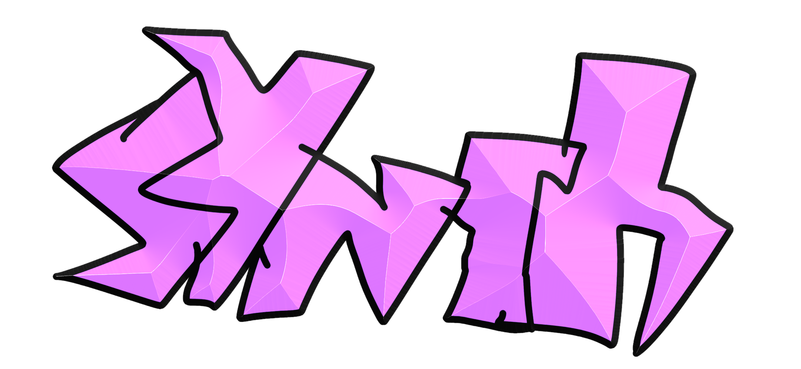

# main

Idk bruh

  

# desc
Meet the synth!
If you don't know what it is, I'll explain:

Synth is a project of mine that will have a CLI, NDK, and well, it's the creator of applications and mods for Geode.
and there are also alternatives:
# alts
phone mods
# final desc
That's all.
